# Ragalahari Gallery Downloader

[](https://www.python.org/downloads/)
[](LICENSE)
[](https://github.com/corinovate/ragalahari-dl/pulls)

A powerful, feature-rich command-line tool to browse and bulk download HD photo galleries from [Ragalahari.com](https://www.ragalahari.com). Search for actors/actresses, browse latest galleries, select multiple galleries with range syntax, and download full-resolution images with parallel threads.

<p align="center">
  
</p>

---

## Features

- **Actor Search** — Search by name with alphabetical index browsing
- **Latest Galleries** — Quick access to newest galleries on the site
- **Gallery Browser** — Browse actor galleries with ID labels and pagination
- **Batch Download** — Select multiple galleries using range syntax (`1-50`, `3,5,7`, `1-10,15-20`, `all`)
- **Download All** — One-click download of every gallery for an actor
- **Category Browsing** — Events, Exclusive Shoots, Movie Stills, Posters
- **HD Images** — Automatically extracts full-resolution images from thumbnails
- **Multi-page Support** — Detects and scans all pages in a gallery
- **Parallel Downloads** — Configurable multi-threaded downloads (default: 5 threads)
- **Progress Tracking** — Real-time progress bars, download stats, file sizes
- **Resume Support** — Skips already-downloaded images
- **Professional CLI** — Color-coded output, paginated lists, clean menus
- **Simple + Advanced Modes** — Easy mode for quick use, advanced for power users
- **Configurable** — Change download folder, thread count, and delay from within the app

## Screenshots

```
     ┌─┬──┬──┬──┬──┬──┬──┬──┬──┬──┬──┬──┬──┬──┬─┐
     │ │▓▓│  │▓▓│  │▓▓│  │▓▓│  │▓▓│  │▓▓│  │▓▓│ │
     ├─┴──┴──┴──┴──┴──┴──┴──┴──┴──┴──┴──┴──┴──┴─┤
     │       ___                                  │
     │      (o o)    /\    Search . Browse         │
     │      __|__   /  \   Select . Download       │
     │     /     \ / HD \  Batch  . Resume         │
     │    / [====] \    /                          │
     │    \       / \  /   ▓▓▓▓▓▓▓▓▓▓▓▓▓▓▓        │
     │     \_____/   \/    ▓ RAGALAHARI  ▓        │
     │      |   |          ▓   GALLERY   ▓        │
     │     /|   |\         ▓  DOWNLOAD   ▓        │
     │    / |   | \        ▓▓▓▓▓▓▓▓▓▓▓▓▓▓▓        │
     │   /__|   |__\                               │
     ├─┬──┬──┬──┬──┬──┬──┬──┬──┬──┬──┬──┬──┬──┬─┤
     │ │▓▓│  │▓▓│  │▓▓│  │▓▓│  │▓▓│  │▓▓│  │▓▓│ │
     └─┴──┴──┴──┴──┴──┴──┴──┴──┴──┴──┴──┴──┴──┴─┘

╔══════════════════════════════════════════════════════════╗
║                                                          ║
║   RAGALAHARI  GALLERY  DOWNLOADER                v2.0   ║
║                                                          ║
║   Bulk HD Photo Downloader  •  ragalahari.com            ║
║                                                          ║
╚══════════════════════════════════════════════════════════╝

  ⚡ 3 incomplete download(s) found!
  Select 'Resume Downloads' below to continue.

  Main Menu
  ─────────────────────────────────────────────
  R  Resume Downloads   Continue where you left off
  1  Latest Galleries   New & trending on the site
  2  Simple Mode        Search, select, download
  3  Advanced Mode      Batch, bulk, categories
  0  Exit
```

```
  ── ADVANCED MODE ──
  1  Batch Download Galleries (select multiple with ranges)
  2  Download ALL Galleries for an Actor
  3  Batch from Gallery URLs (paste multiple URLs)
  4  Browse by Category (latest, events, photoshoots)
  5  Inspect Page (debug HTML structure)
  6  Settings
  0  Back to main menu
```

## Installation

### Prerequisites

- Python 3.7 or higher

### Install from PyPI (Recommended)

```bash
pip install ragalahari-dl
ragalahari-dl
```

### Install from Source

```bash
# Clone the repository
git clone https://github.com/corinovate/ragalahari-dl.git
cd ragalahari-dl

# Install dependencies
pip install -r requirements.txt

# Run
python ragalahari_dl.py
```

### Standalone Executable (no Python needed)

Download `ragalahari-dl.exe` from the [Releases](https://github.com/corinovate/ragalahari-dl/releases) page — just double-click and run, no Python installation required.

To build the `.exe` yourself:

```bash
pip install pyinstaller
python build.py
```

The executable will be in the `dist/` folder.

## Usage

### Simple Mode — Search and Download

1. Run the script: `python ragalahari_dl.py`
2. Select **Simple Mode** (option 2)
3. Choose **Search & Download** (option 1)
4. Type an actor/actress name (e.g., `Kajal`)
5. Select the actor from results
6. Pick a gallery and confirm download

### Latest Galleries

1. Select **Latest Galleries** (option 1) from main menu
2. Browse the latest galleries
3. Pick one or select multiple with ranges

### Batch Download (Advanced Mode)

1. Select **Advanced Mode** (option 3)
2. Choose **Batch Download Galleries** (option 1)
3. Search for an actor
4. Use range syntax to select galleries:

```
  Select gallery(s) > 1-50        # galleries 1 through 50
  Select gallery(s) > 3,5,7,12    # specific galleries
  Select gallery(s) > 1-10,15-20  # mixed ranges
  Select gallery(s) > all         # everything
```

### Direct URL Download

If you already have a gallery URL:

```bash
# Simple Mode > Paste Gallery URL (option 2)
# Paste: https://www.ragalahari.com/actress/172760/gallery-name.aspx
```

### Browse by Category

Advanced Mode lets you browse:

- Latest Galleries
- Actress Galleries
- Events & Functions
- Exclusive Shoots
- Movie Stills
- Movie Posters

## Configuration

Access settings from **Advanced Mode > Settings** (option 6):

| Setting | Default | Description |
|---------|---------|-------------|
| Download folder | `./downloads` | Where images are saved |
| Parallel threads | `5` | Concurrent download threads (1-20) |
| Page delay | `0.5s` | Delay between page fetches |

Images are saved in: `downloads/<ActorName>/<GalleryName>/`

## How It Works

1. **Search**: Loads the alphabetical star index, navigates to the correct letter page, and filters actors by name
2. **Gallery listing**: Parses the actor's profile page for all gallery links with numeric IDs
3. **Image extraction**: Finds thumbnail images inside `<div id="galdiv">` and converts thumbnail URLs to full-size by removing the `t` suffix (e.g., `image1t.jpg` → `image1.jpg`)
4. **Pagination**: Detects multi-page galleries via `<td id="pagingCell">` navigation links
5. **Download**: Parallel threaded downloads with retry logic, size validation, and duplicate detection

## Project Structure

```
ragalahari-dl/
├── ragalahari_dl.py     # Main application
├── requirements.txt      # Python dependencies
├── setup.py              # Package installer
├── LICENSE               # MIT License
├── CHANGELOG.md          # Version history
├── README.md             # This file
└── downloads/            # Default download directory (created at runtime)
```

## Contributing

Contributions are welcome! Here are some ideas:

- Add support for more gallery types
- GUI version (Tkinter/PyQt)
- Download queue with pause/resume
- Image metadata extraction
- Proxy support
- Export gallery lists to JSON/CSV

### How to contribute

1. Fork the repository
2. Create a feature branch (`git checkout -b feature/amazing-feature`)
3. Commit your changes (`git commit -m 'Add amazing feature'`)
4. Push to the branch (`git push origin feature/amazing-feature`)
5. Open a Pull Request

## Disclaimer

This tool is for personal use only. Please respect the website's terms of service and the intellectual property rights of content creators. Do not use this tool for commercial purposes or to redistribute copyrighted content. Be mindful of server load — the tool includes built-in delays between requests.

## License

This project is licensed under the MIT License — see the [LICENSE](LICENSE) file for details.

## Acknowledgments

- [Ragalahari.com](https://www.ragalahari.com) for hosting amazing photography
- [Beautiful Soup](https://www.crummy.com/software/BeautifulSoup/) for HTML parsing
- [Requests](https://docs.python-requests.org/) for HTTP handling
